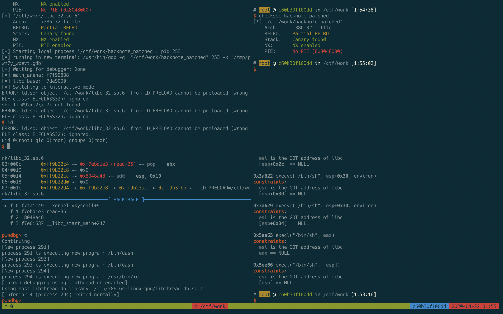

Pwndocker
=========

A Docker environment for CTF pwning based on a modified Ubuntu 20.04 `phusion/baseimage:master-amd64`.

Forked from [skysider/pwndocker](https://github.com/skysider/pwndocker).



## Usage

```shell
$ docker run --rm -v "$PWD":/ctf/work \
  --cap-add=SYS_PTRACE -it pwndocker:latest
```

### Included software

- [pwntools](https://github.com/Gallopsled/pwntools) —— CTF framework and exploit development library
- [pwndbg](https://github.com/pwndbg/pwndbg) —— A GDB plug-in that makes debugging with GDB suck less, with a focus on features needed by low-level software developers, hardware hackers, reverse-engineers and exploit developers
- [pwngdb](https://github.com/scwuaptx/Pwngdb) —— GDB for pwn
- [ROPgadget](https://github.com/JonathanSalwan/ROPgadget) —— Facilitate ROP exploitation tool
- [roputils](https://github.com/inaz2/roputils)	—— A Return-oriented Programming toolkit
- [one_gadget](https://github.com/david942j/one_gadget) —— A searching one-gadget of execve('/bin/sh', NULL, NULL) tool for amd64 and i386
- [z3](https://github.com/Z3Prover/z3) —— The Z3 Theorem Prover
- [angr](https://github.com/angr/angr) ——  A platform-agnostic binary analysis framework
- [radare2](https://github.com/radare/radare2) ——  A rewrite from scratch of radare in order to provide a set of libraries and tools to work with binary files
- [seccomp-tools](https://github.com/david942j/seccomp-tools) —— Provide powerful tools for seccomp analysis
- [tmux](https://tmux.github.io/)	—— A terminal multiplexer
- [ltrace](https://linux.die.net/man/1/ltrace) —— Trace library function call
- [strace](https://linux.die.net/man/1/strace) —— Trace system call
- [qemu](https://www.qemu.org/) —— A generic and open source machine emulator and virtualizer

### Included glibc

Default compiled glibc path is `/glibc`.

- 2.19 —— Ubuntu 12.04 default libc version
- 2.23 —— Ubuntu 16.04 default libc version
- 2.24 —— Introduce vtable check in file struct
- 2.27 —— Pwndocker default glibc version
- 2.28~2.31 —— Latest libc versions

#### Running custom libc versions

`ld.so` files for each libc version can be found in their respective folders under `/glibc/<version>/<arch>/lib/ld-<version>.so`.

```shell
$ cp /glibc/2.27/64/lib/ld-2.27.so /tmp/ld-2.27.so
$ patchelf --set-interpreter /tmp/ld-2.27.so ./test
$ LD_PRELOAD=./libc.so.6 ./test
```

or

```python
from pwn import *
p = process(["/path/to/ld.so", "./test"], env={"LD_PRELOAD":"/path/to/libc.so.6"})
```
